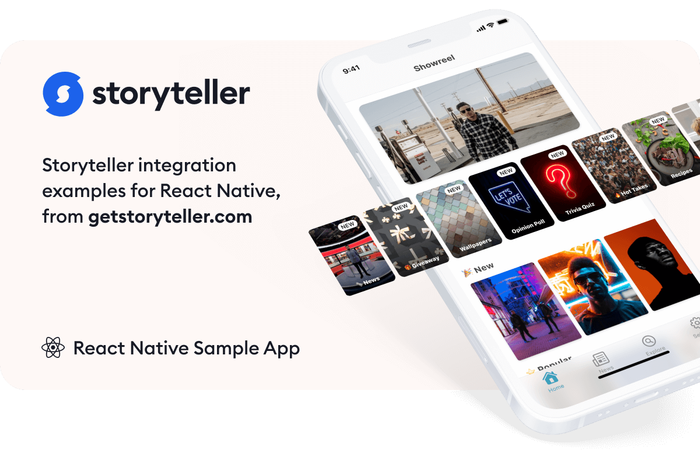

# Storyteller React Native Sample App

<a href="https://getstoryteller.com" target="_blank">
  
</a>

<p>
  <a href="https://getstoryteller.com" target="_blank"></a>&nbsp;&nbsp;&nbsp;
  <a href="https://docs.getstoryteller.com/documents/react-native-sdk" target="_blank"></a>
</p>

Use this repo as a reference for integrating Storyteller in your React Native App.

Storyteller is also available in native implementations for [iOS](https://github.com/getstoryteller/storyteller-sample-ios), [Android](https://github.com/getstoryteller/storyteller-sample-android) and [Web](https://github.com/getstoryteller/storyteller-sample-web).

For help with Storyteller, please check our [Documentation and User Guide](https://docs.getstoryteller.com/documents/) or contact [support@getstoryteller.com](mailto:support@getstoryteller.com?Subject=React%Native%20Sample%20App).

## Building the Sample App

To run the sample app (Android):

```
    yarn example android
```

or

```
    npm install
    npx react-native run-android
```

To run the sample app (iOS):

```
    yarn example ios
```

or

```
    npm install
    npx react-native run-ios
```